### Reusable Components React

## Janvier 2020
 

**all off this components are reusable on any react application**


[Demo](#demo)

-  [Movie](#movie-demo)


[Author](#author)

[License](#license)

[Start Project](#Start-project)

---
## Demo
---
### Movie Demo off all components : 

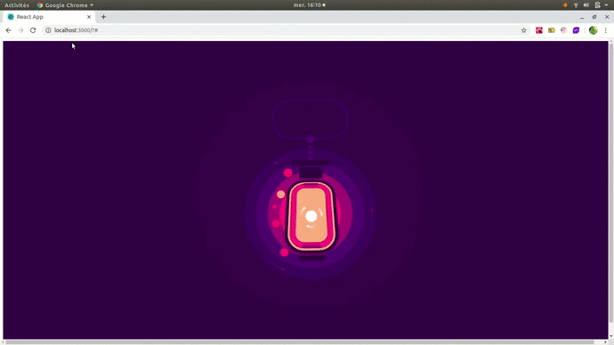 AnimatedLantern
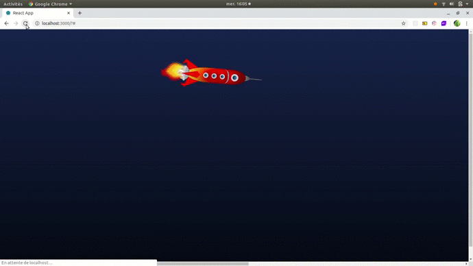 AnimatedRocket
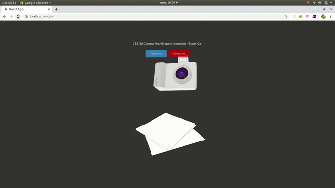 CameraAnimation3d
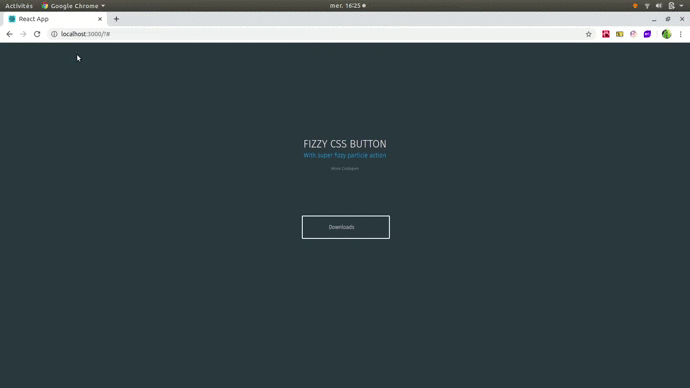 FizzyButton
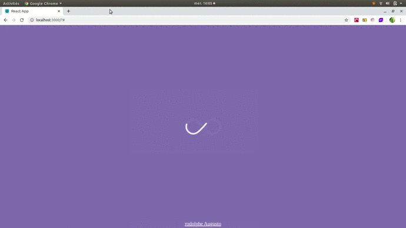 InfiniteLoopLoader
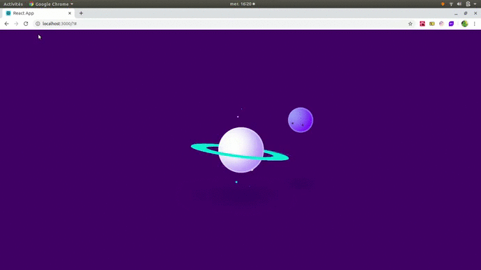 LoadingPage
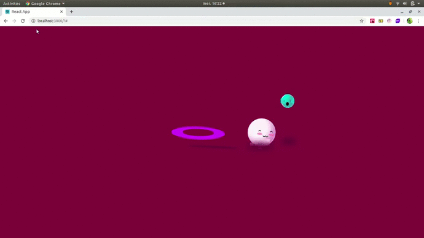 LoadingPage2
 MagazineStyleLayout
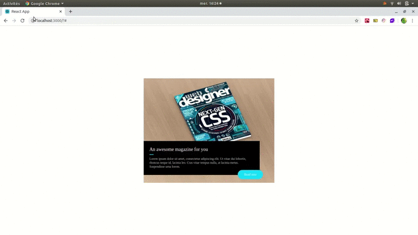 Magazine3DFlip
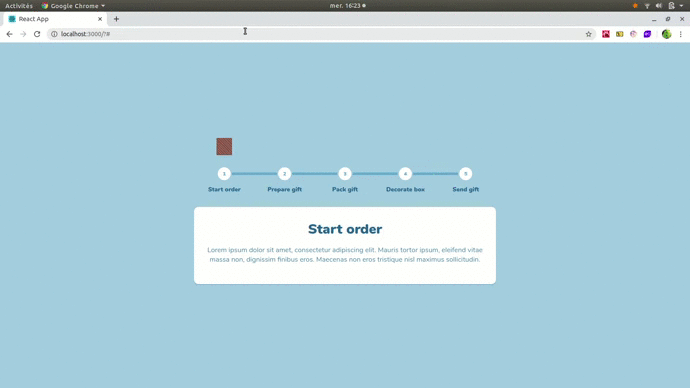 OrderProcessSteps
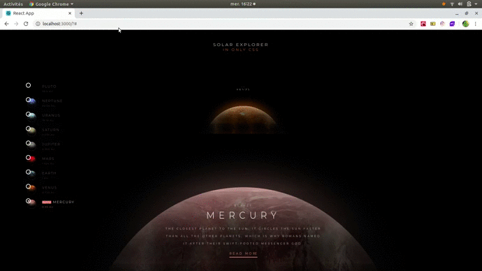 SolarSystemExplorer
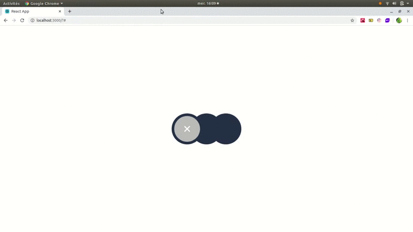 ToggleSwitch


---

## Tech Stack

 **You must have at minimun these versions for greats performances and good compatibility**

 **Version of Node js**
-    v8.16.2 minimun

---  

## Author 

- Rodolphe Augusto 

--- 

## License  

- MIT.

---

## Start project


- Clone or download this repo https://github.com/rodolphe37/reusable-components-react.git
 

Doing in the console :

-  ``` $ cd reusable-components-react```

to going to our frontend folder, then doing:

 ``` $ nvm use ```

 to synchronize your node version, and do it in the console: 

-  ```  $ npm i``` or ``` $ npm install ```

to install the dependencies and

-  ``` $ npm start```

to start  frontEnd project.

All off these components are commented, you must uncomment the component you wish for seeing.

  

enjoy!!!
